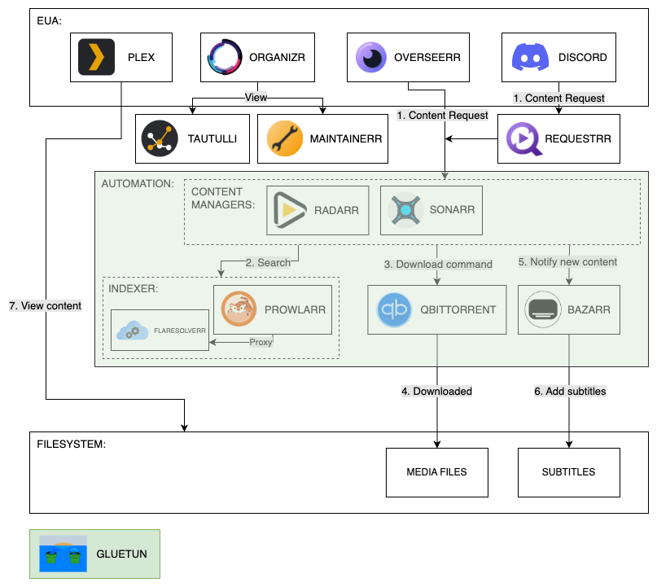

# Plex Server

This repository contains information on how to setup a [Plex](https://www.plex.tv/) server using [Docker 24.0+](https://www.docker.com/).

## User experience requesting content

1. User finds new movie or TV show they want.
2. The user puts a request for the content in via one of the following:
   1. Overseerr web interface.
   2. Through Discord connected to Requestrr.
3. A request for the content is sent to Sonarr (TV Show) or Radarr (Movie).
4. Sonarr/Radarr ask Prowlarr for the content.
5. Sonarr/Radarr queue the download (if available) in qBittorrent.
6. qBittorrent downloads the content.
7. Sonarr/Radarr request Bazarr to download subtitles for the content.
8. The content becomes available in Plex to watch with subtitles.

## Architecture

Below is the architectural diagram showing how each service interacts with one another. It provides a step by step flow of general usage.

<picture>
  <source media="(prefers-color-scheme: dark)" srcset="./architecture.dark.png">
  <source media="(prefers-color-scheme: light)" srcset="./architecture.light.png">
  
</picture>

> NOTE: The entirety of the automation section (highlighted in green) is protected by [Gluetun](https://github.com/qdm12/gluetun). This ensures all traffic goes through the VPN client setup.

The following is a list of services NOT on the VPN:

- [Plex](https://www.plex.tv/)
- [Overseerr](https://overseerr.dev/)
- [Requestrr](https://github.com/thomst08/requestrr)
- [Maintainerr](https://github.com/jorenn92/Maintainerr)
- [Tautulli](https://tautulli.com/)

The following is a list of services on the VPN:

- [Sonarr](https://sonarr.tv/)
- [Radarr](https://radarr.video/)
- [Bazarr](https://www.bazarr.media/)
- [Prowlarr](https://prowlarr.com/)
- [FlareSolverr](https://github.com/FlareSolverr/FlareSolverr)

## Directory Structure

The following is a list of all relevant directories used by the server. You can ensure that all of these directories exist by running the `init.sh` script.

```sh
# Docker container state directories:
/data/dockerdata/plex         # Plex
/data/dockerdata/overseerr    # Overseerr
/data/dockerdata/requestrr    # Requestrr
/data/dockerdata/maintainerr  # Maintainerr
/data/dockerdata/tautulli     # Tautulli
/data/dockerdata/sonarr       # Sonarr
/data/dockerdata/radarr       # Radarr
/data/dockerdata/bazarr       # Bazarr
/data/dockerdata/prowlarr     # Prowlarr
/data/dockerdata/qbittorrent  # qBittorrent

# Directories for Torrents:
/data/torrents/movies         # Movies
/data/torrents/tv             # TV Shows

# Directories for Media:
/data/media/movies            # Movies
/data/media/tv                # TV Shows
```

## Setup

Documentation for setting up the Plex server with each service can be found [here](./docs/README.md).

## Updating existing instancee

To update an existing deployed stack using `docker compose` run the following commands:

```sh
# Pull the latest changes container images.
docker compose pull
# Recreate any instances that have changed.
docker compose up -d
```

> NOTE: you do not need to run `docker compose down` as `docker compose up` will recreate any containers that have updated.
